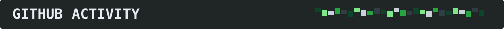

<!-- README del perfil de GitHub. No modifica el avatar ni la barra lateral. -->

> Soy Marcelo Lemos, profesional de sistemas con más de 15 años de experiencia en plataformas críticas. Combino administración Linux, ingeniería de datos, automatización y análisis funcional para construir soluciones sostenibles.

> Diseño y mantengo plataformas de datos, automatizo procesos y pruebas, trabajo con bases de datos relacionales y aplico observabilidad y prácticas DevOps a sistemas en producción.

> Sistemas trazables, reproducibles y mantenibles. Menos fricción operativa, mayor calidad de datos y herramientas que ayuden a tomar mejores decisiones.

> Desarrollo herramientas abiertas, experimento con terminales y software, y comparto soluciones prácticas para otros profesionales.

<table align="center"><tr>
<td align="center"><a href="https://github.com/maniat1k"> GitHub</a></td>
<td align="center"><a href="https://www.linkedin.com/in/marcelolemosuy/"> LinkedIn</a></td>
<td align="center"><a href="https://x.com/maniat1kUy"> X</a></td>
<td align="center"><a href="https://maniat1k.github.io"> Sitio web</a></td>
<td align="center"><a href="https://ko-fi.com/maniat1kuy"> Ko-fi</a></td>
</tr></table>

| Proyecto | Descripción |
|:--|:--|
| [**SlimWin**](https://github.com/maniat1k/SlimWin-) | Optimización de Windows con interfaz Avalonia / .NET |
| [**Solarizedxterm**](https://github.com/maniat1k/solarizedxterm) | Tema de terminal centrado en legibilidad |
| [**Birame**](https://github.com/maniat1k/birame) | Tema ZSH y personalización de shell |
| [**Windows11 FixMBR**](https://github.com/maniat1k/windows11_fixMBR) | Reparación del arranque de Windows |
| [**Ahorro Visual**](https://maniat1k.github.io/ahorro.html) | Simulador interactivo de ahorro |

«Automatizar no es escribir scripts. Es diseñar sistemas que se sostienen solos.»

 

